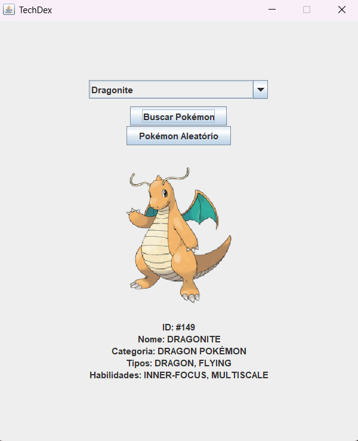
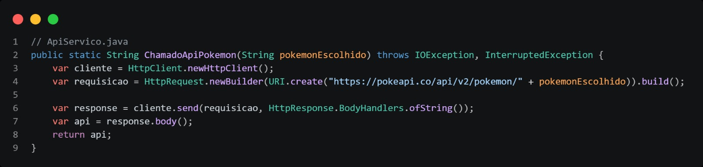
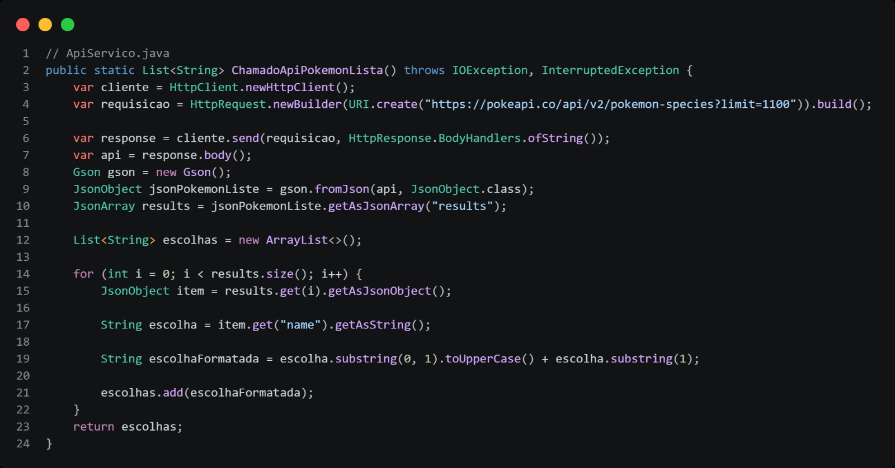
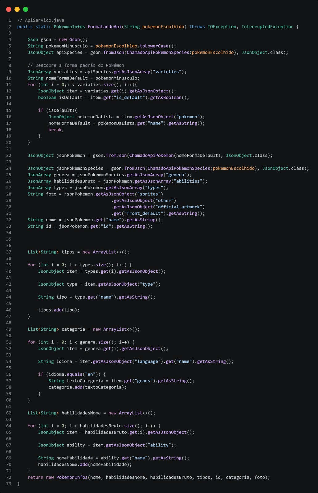
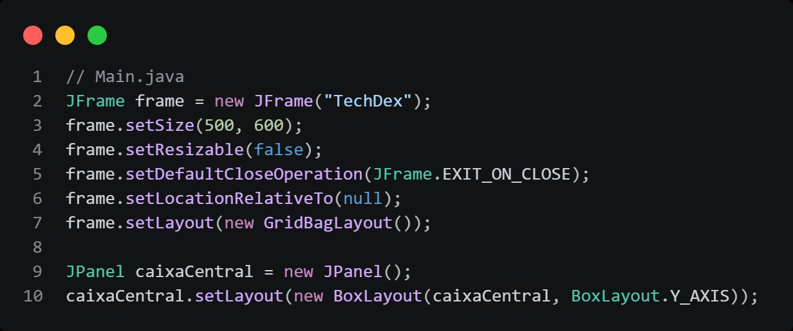
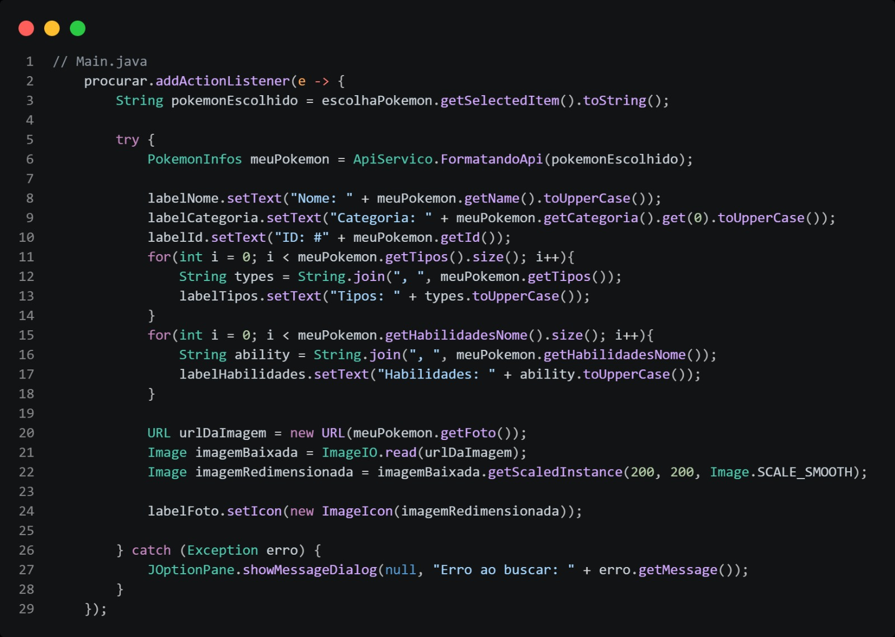

# TechDex

> Uma Pokédex desktop feita em Java, consumindo a [PokéAPI](https://pokeapi.co/) e exibindo as informações em uma janela criada com Swing.

---

### Objetivo do Projeto

O **TechDex** foi desenvolvido com o objetivo de colocar em prática meus conhecimentos de:

- **Consumo de APIs REST em Java** — realizando requisições HTTP, recebendo respostas em JSON e fazendo o parse dos dados com a biblioteca Gson.
- **Criação de interfaces gráficas desktop** — construindo uma janela funcional com Java Swing, utilizando layouts, componentes e eventos.

A aplicação permite buscar qualquer Pokémon pelo nome (a partir de uma lista completa carregada da API) ou sortear um aleatoriamente, exibindo suas informações e imagem oficial em tempo real.

---

### Funcionalidades

- Lista completa com mais de 1.000 Pokémons carregada direto da PokéAPI
- Busca de Pokémon por nome via dropdown
- Botão de Pokémon aleatório
- Exibição da artwork oficial do Pokémon
- Informações exibidas: **ID**, **Nome**, **Categoria**, **Tipos** e **Habilidades**

---

### Estrutura do Projeto

```
TechDex/
└── src/main/
    └── java/org/pokemon/
        ├── Main.java           # Interface gráfica (Swing) e ponto de entrada
        ├── ApiServico.java     # Camada de serviço — requisições HTTP e parse do JSON
        └── PokemonInfos.java   # Model — representa os dados de um Pokémon
```

---
### Interface do Projeto

A interface final do projeto é simples e funcional:



---

### Tecnologias e Dependências

| Tecnologia | Uso |
|---|---|
| Java 17+ | Linguagem principal |
| Java Swing | Interface gráfica desktop |
| Java `HttpClient` | Requisições HTTP para a PokéAPI |
| [Gson](https://github.com/google/gson) | Parse do JSON retornado pela API |
| [PokéAPI](https://pokeapi.co/) | Fonte dos dados dos Pokémons |
| Maven | Gerenciamento de dependências |

---

### Trechos Importantes do Código

### 1. Requisição HTTP para a PokéAPI

Usando o `HttpClient` nativo do Java para fazer chamadas GET à API:



---

### 2. Carregamento da lista completa de Pokémons

Busca mais de 1.000 nomes de uma vez e os formata para exibição:



---

### 3. Parse e montagem do objeto PokemonInfos

Combina dados de dois endpoints (`/pokemon` e `/pokemon-species`) para montar o objeto completo, lidando com variantes de forma do Pokémon:



---

### 4. Criação da janela com Java Swing

Montagem do `JFrame` com layout, componentes e centralização na tela:



---

### 5. Evento de busca — carregando e exibindo a imagem

Ao clicar em "Buscar Pokémon", os dados são buscados e a imagem é baixada e redimensionada dinamicamente:



---

### Como Executar

### Pelo executável
Baixe o arquivo `TechDex-1.0.exe` disponível no repositório e execute diretamente (Windows).

### Pelo código-fonte

**Pré-requisitos:** Java 17+ e Maven instalados.

```bash
# Clone o repositório
git clone https://github.com/PedroJona00/TechDex.git
cd TechDex

# Compile e execute com Maven
mvn compile exec:java
```

> ⚠️ É necessário conexão com a internet para carregar a lista de Pokémons e as imagens ⚠️.

---

*Projeto desenvolvido por [Pedro Jonatha](https://github.com/PedroJona00)*